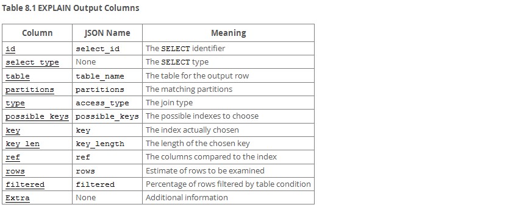
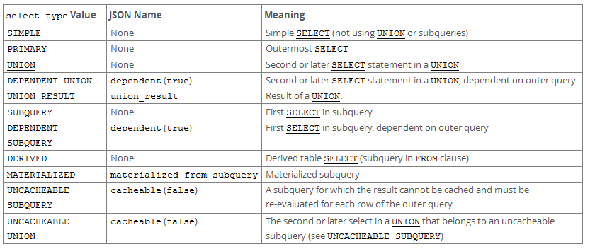

## [8.8.2 EXPLAIN Output Format](http://dev.mysql.com/doc/refman/5.6/en/explain-output.html)

> You cannot use the `EXTENDED` and `PARTITIONS` keywords together in the same `EXPLAIN` statement. In MySQL 5.6.5 and later, neither of these keywords can be used together with the `FORMAT` option. (`FORMAT=JSON` causes `EXPLAIN` to display extended and partition information automatically; using `FORMAT=TRADITIONAL` has no effect on `EXPLAIN` output.)

+ [EXPLAIN Output Columns](#output)
+ [EXPLAIN Join Types](#join)
+ [EXPLAIN Extra Information](#information)
+ [EXPLAIN Output Interpretation](#interpretation)

#### 
EXPLAIN Output Columns

+ `id`

SELECT 查询的序号。如果是其他行的 union 结果可为 NULL <unionM, N>

+ `select_type`

SELECT 的类型

+ `table`
+ ` partitions`

This column is displayed only if the `PARTITIONS` keyword is used

+ `type`
+ `possible_keys`

> If this column is `NULL` (or undefined in JSON-formatted output), there are no relevant indexes. In this case, you may be able to improve the performance of your query by examining the `WHERE` clause to check whether it refers to some column or columns that would be suitable for indexing. If so, create an appropriate index and check the query with `EXPLAIN` again.

+ `key`

实际查询使用的 key
>For `MyISAM` and `NDB` tables, running `ANALYZE TABLE` helps the optimizer choose better indexes.

+ `key_len`
+ `ref`
+ `rows`

> For `InnoDB` tables, this number is an estimate, and may not always be exact.

+ `filtered`
+ `Extra`

#### 
EXPLAIN Join Types

表连接的方式，按最优方式到最糟方式排列：

+ `system`

仅有一行，是 `const` 连接方式的特殊情况。

+ `const`

最多有一行匹配，常见于 `PRIMARY KEY` or `UNIQUE` index to constant values.
~~~mysql
SELECT * FROM tbl_name WHERE primary_key = 1;

SELECT * FROM tbl_name
  WHERE primary_key_part1 = 1 AND primary_key_part2 = 2;
~~~

+ `eq_ref`

可能是最好的连接方式， It is used when all parts of an index are used by the join and the index is a `PRIMARY KEY` or `UNIQUE NOT NULL` index.
~~~mysql
SELECT * FROM ref_table,other_table
  WHERE ref_table.key_column = other_table.column;

SELECT * FROM ref_table,other_table
  WHERE ref_table.key_column_part1 = other_table.column
  AND ref_table.key_column_part2 = 1;
~~~

+ `ref`

>  ref is used if the join uses only a leftmost prefix of the key or if the key is not a `PRIMARY KEY` or `UNIQUE` index (in other words, if the join **cannot select a single row based on the key value**). If the key that is used matches only a few rows, this is a good join type.
~~~mysql
SELECT * FROM ref_table WHERE key_column=expr;

SELECT * FROM ref_table,other_table
  WHERE ref_table.key_column = other_table.column;

SELECT * FROM ref_table,other_table
  WHERE ref_table.key_column_part1 = other_table.column
  AND ref_table.key_column_part2 = 1;
~~~

+ `fulltext`
+ `ref_or_null`

> This join type is like `ref`, but with the addition that MySQL does an extra search for rows that contain `NULL` values. 常见于子查询
~~~mysql
SELECT * FROM ref_table
  WHERE key_column=expr OR key_column IS NULL;
~~~

+ `index_merge`
+ `unique_subquery`
~~~
value IN (SELECT primary_key FROM single_table WHERE some_expr)
~~~

> unique_subquery is just an index lookup function that replaces the subquery completely for better efficiency.

+ `index_subquery`

~~~
value IN (SELECT key_column FROM single_table WHERE some_expr)
~~~

+ `range`

> `range` can be used when a key column is compared to a constant using any of the =, <>, >, >=, <, <=, `IS NULL`, <=>, `BETWEEN`, or `IN()` operators:

~~~mysql
SELECT * FROM tbl_name
  WHERE key_column = 10;

SELECT * FROM tbl_name
  WHERE key_column BETWEEN 10 and 20;

SELECT * FROM tbl_name
  WHERE key_column IN (10,20,30);

SELECT * FROM tbl_name
  WHERE key_part1 = 10 AND key_part2 IN (10,20,30);
~~~

+ `index`
+ `ALL`

#### 
EXPLAIN Extra Information

[EXPLAIN Extra Information](http://dev.mysql.com/doc/refman/5.6/en/explain-output.html#explain-extra-information)

#### 
EXPLAIN Output Interpretation

[EXPLAIN Output Interpretation](http://dev.mysql.com/doc/refman/5.6/en/explain-output.html#explain-output-interpretation)